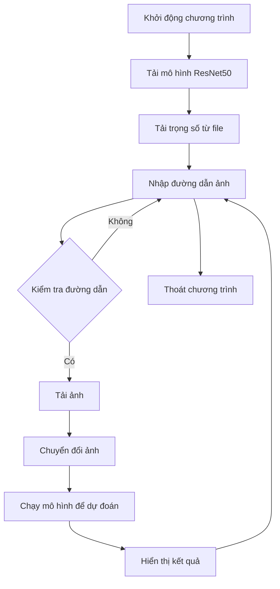

# 🌟 Phân loại ảnh MRI não 🌟

Chương trình này sử dụng mô hình **ResNet50** để phân loại ảnh MRI não thành hai loại: **Khỏe mạnh** và **U não**. Mô hình được huấn luyện trước và có thể dự đoán dựa trên các ảnh đầu vào.

## 📋 Yêu cầu

- **Python**: 3.10.12
- **PyTorch**: 2.5.1
- **Torchvision**: 0.20.1
- **NumPy**: 1.26.4
- **Matplotlib**: 3.7.5

## 🚀 Cài đặt

1. Cài đặt các thư viện cần thiết:
   ```bash
   pip install torch torchvision numpy matplotlib
   ```

2. Tải mô hình đã huấn luyện và lưu vào file `best_mri_model.pth`.

3. Đảm bảo rằng bạn có các ảnh MRI để thử nghiệm.

## 🛠️ Cách sử dụng

1. Chạy chương trình:
   ```bash
   python test_model.py
   ```

2. Nhập đường dẫn đến ảnh MRI mà bạn muốn phân loại. Bạn có thể nhập 'exit' để thoát chương trình.

3. Kết quả dự đoán sẽ được hiển thị cùng với ảnh.

## 📊 Flowchart

Dưới đây là flowchart mô tả quy trình hoạt động của chương trình:



## 📜 Mô tả mã nguồn

### Các phần chính của mã nguồn:

1. **Khởi tạo mô hình**:
   - Sử dụng mô hình ResNet50 với trọng số đã được huấn luyện trước.
   - Đóng băng các tham số của mô hình để chỉ huấn luyện lớp fully connected.

2. **Biến đổi ảnh**:
   - Chuyển đổi ảnh đầu vào để phù hợp với định dạng mà mô hình yêu cầu.

3. **Hàm dự đoán**:
   - Tải ảnh từ đường dẫn, chuyển đổi và chạy mô hình để dự đoán.

4. **Chương trình chính**:
   - Nhập đường dẫn ảnh từ người dùng và hiển thị kết quả dự đoán.

## 📧 Liên hệ

Nếu bạn có bất kỳ câu hỏi nào, vui lòng liên hệ với tôi qua email: [nguyentrongphuoc.ai@gmail.com].

---

✨ **Cảm ơn bạn đã xem! Chúc bạn thành công với dự án của mình!** ✨
